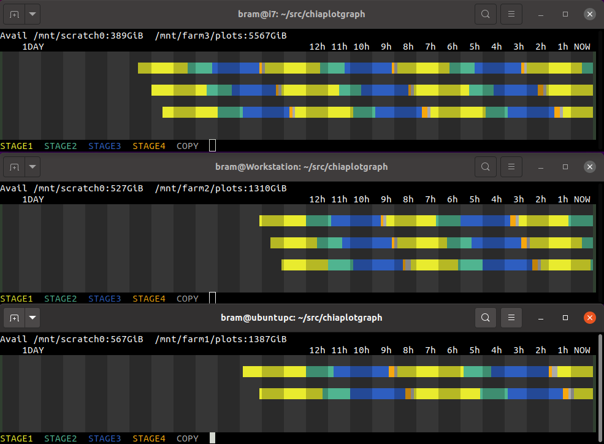

# Chia Plot Graph
Monitor for Chia Plotting




## Introduction

The chiaplotgraph tool will graph Chia Plotting activity in a linux terminal. Use a 24-bit colour terminal, like xterm or gnome-terminal.


## Building

```
$ git clone https://github.com/stolk/chiaplotgraph.git

$ cd chiaplotgraph

$ make
```

## Launching

To use it:

**$ ./chiaplotgraph plotter-log.0 plotter-log.1 .. plotter-log.N**

Leave the tool running, as it keeps checking the log. More pixels will scroll in from the right.

## Rationale

It's quite a challenge to optimize your plotting throughput.
So this tool is to keep track of how long each stage takes when creating Chia farm plots.

You feed it the log files from your plot runs.


## Function

The tool reads all log files that are provided on the command line, and then extracts the start and end timestamps for the plot stages.

**NOTE:** You can see more days of the week by simply resizing your terminal to be wider.

## Colours

See legend how the colours map onto the stages.

## Keys

Press ESCAPE or Q to exit chiaplotgraph.


## Did you know that...

* Chia Plot Graph has a companion app called [Chia Harvest Graph](https://github.com/stolk/chiaharvestgraph).


## Donations

Chia Plot Graph is a tool by Bram Stolk, who is on Twitter as: @BramStolk where he mostly tweets about game development.

If you find this tool useful, donations can go to XCH wallet:
xch1zfgqfqfdse3e2x2z9lscm6dx9cvd5j2jjc7pdemxjqp0xp05xzps602592

## Known issues

* Shows garbage on terminals that do not support 24 bit colour.
* Missing manual page.
* It looks [weird](https://imgur.com/a/GkzPie2) when going through putty.

## Copyright

chiaplotgraph is (c)2021 by Bram Stolk and licensed under the MIT license.

